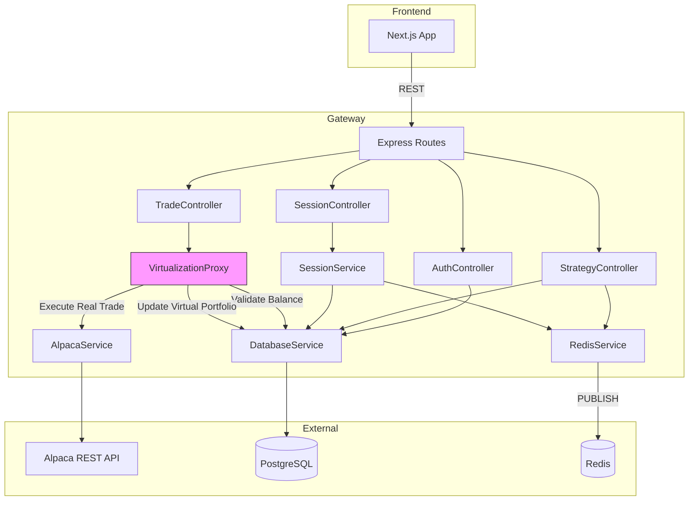
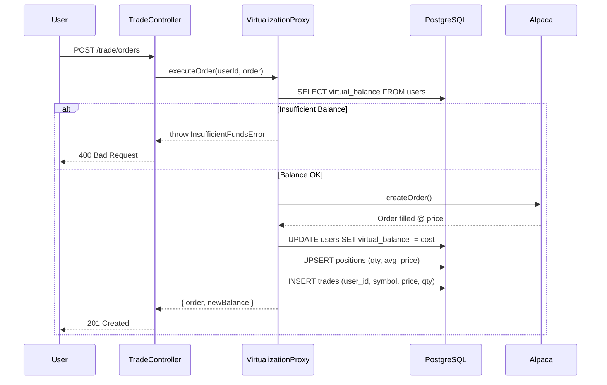

# Gateway Service Design

## Overview

The **gateway-node** service is the central REST API hub. It handles user authentication, strategy CRUD, session management, and trade execution via the Alpaca API.

---

## Architecture



---

## REST API Endpoints

### Auth Routes (`/api/auth`)
| Method | Endpoint | Controller | Description |
|--------|----------|------------|-------------|
| POST | `/register` | `AuthController.register` | Create new user |
| POST | `/login` | `AuthController.login` | Login, returns JWT |

### Strategy Routes (`/api/strategies`)
| Method | Endpoint | Controller | Description |
|--------|----------|------------|-------------|
| GET | `/` | `StrategyController.list` | List user's strategies |
| POST | `/` | `StrategyController.create` | Create new strategy |
| GET | `/:id` | `StrategyController.getById` | Get single strategy |
| PUT | `/:id` | `StrategyController.update` | Update strategy |
| DELETE | `/:id` | `StrategyController.delete` | Delete strategy |
| POST | `/:id/stop` | `StrategyController.stopSessions` | Stop running sessions |

### Session Routes (`/sessions`)
| Method | Endpoint | Controller | Description |
|--------|----------|------------|-------------|
| POST | `/` | `SessionController.start` | Start new session |
| POST | `/:id/stop` | `SessionController.stop` | Stop session |

### Trade Routes (`/trade`)
| Method | Endpoint | Controller | Description |
|--------|----------|------------|-------------|
| GET | `/account` | `TradeController.getAccount` | Alpaca account info |
| GET | `/positions` | `TradeController.getPositions` | Alpaca positions |
| GET | `/orders` | `TradeController.getOrders` | Alpaca orders |
| POST | `/orders` | `TradeController.placeOrder` | Place order via Alpaca |

### User Routes (`/api`)
| Method | Endpoint | Controller | Description |
|--------|----------|------------|-------------|
| GET | `/portfolio` | `TradeController.getPortfolio` | Virtual portfolio |
| GET | `/positions` | `TradeController.getUserPositions` | Virtual positions |
| GET | `/trades` | `TradeController.listUserTrades` | Trade history |

### Internal Routes (`/internal`)
| Method | Endpoint | Controller | Description |
|--------|----------|------------|-------------|
| POST | `/execute` | `TradeController.execute` | Worker sends signals here |

---

## Controllers

### AuthController
Handles JWT-based authentication.

| Method | Purpose |
|--------|---------|
| `register()` | Hash password, insert user, return JWT |
| `login()` | Verify password, return JWT |

### StrategyController
Full CRUD for trading strategies.

| Method | Purpose |
|--------|---------|
| `create()` | Insert strategy with python_code |
| `list()` | Get all strategies for user with session status |
| `getById()` | Get single strategy with running session info |
| `update()` | Update name, symbol, code |
| `stopSessions()` | Stop running sessions, cleanup Redis |
| `delete()` | Stop sessions, delete from DB |

### SessionController
Manages strategy execution sessions.

| Method | Purpose |
|--------|---------|
| `start()` | Create session, add to Redis set, publish subscribe event |
| `stop()` | Update status, remove from Redis, publish unsubscribe |

### TradeController
Trade execution and portfolio management.

| Method | Purpose |
|--------|---------|
| `getAccount()` | Proxy to Alpaca account endpoint |
| `getPositions()` | Proxy to Alpaca positions |
| `placeOrder()` | Place order via Alpaca, update virtual portfolio |
| `getOrders()` | Proxy to Alpaca orders |
| `execute()` | Receive signals from Worker, execute trade |
| `listUserTrades()` | Query trades table for user |
| `getPortfolio()` | Get virtual balance + positions |
| `getUserPositions()` | Get virtual positions only |

---

## Services

### AlpacaService
Wraps `@alpacahq/alpaca-trade-api` for REST calls.

```typescript
alpacaService.getAccount()
alpacaService.getPositions()
alpacaService.getOrders(status)
alpacaService.createOrder(params)
```

### RedisService
Publishes control events and manages Redis sets.

| Method | Purpose |
|--------|---------|
| `publish(channel, message)` | Publish JSON to channel |
| `addToSet(key, value)` | Add symbol to active subscriptions |
| `removeFromSet(key, value)` | Remove symbol from set |

### SessionService
Orchestrates session lifecycle.

| Method | Purpose |
|--------|---------|
| `startSession(session)` | Add to Redis + publish subscribe event |
| `stopSession(id)` | Update DB + publish unsubscribe event |

### DatabaseService
Raw SQL queries via `pg` pool.

### VirtualizationProxy ⚠️ *Planned*
Abstracts the shared Alpaca account to provide per-user virtual portfolios.

| Method | Purpose |
|--------|---------|
| `validateBalance(userId, orderCost)` | Check if user has sufficient virtual balance |
| `executeOrder(userId, order)` | Execute via Alpaca, then attribute to user |
| `updatePosition(userId, symbol, qty, price)` | Upsert virtual position with new avg price |
| `getVirtualPortfolio(userId)` | Return virtual balance + positions with live prices |



> **Note**: See [virtualization_design.md](./virtualization_design.md) for full architecture details.

---

## Redis Interactions

| Direction | Channel/Key | Purpose |
|-----------|-------------|---------|
| **PUBLISH** | `system:subscription_updates` | Notify Ingestor/Worker of session changes |
| **WRITE** | `active_subscriptions:stock` | Track active stock symbols |
| **WRITE** | `active_subscriptions:crypto` | Track active crypto symbols |

---

## Session Lifecycle Event

```typescript
interface ControlEvent {
    action: "subscribe" | "unsubscribe";
    symbol: string;
    type: "stock" | "crypto";
    strategyId?: string;
    sessionId?: string;
}
```

---

## File Structure

```
services/gateway-node/
├── src/
│   ├── index.ts              # Express app setup
│   ├── db.ts                 # PostgreSQL pool
│   ├── config/
│   │   └── index.ts          # Environment config
│   ├── controllers/
│   │   ├── AuthController.ts
│   │   ├── SessionController.ts
│   │   ├── StrategyController.ts
│   │   └── TradeController.ts
│   ├── routes/
│   │   ├── authRoutes.ts
│   │   ├── sessionRoutes.ts
│   │   ├── strategyRoutes.ts
│   │   ├── tradeRoutes.ts
│   │   └── internalRoutes.ts
│   ├── services/
│   │   ├── AlpacaService.ts
│   │   ├── DatabaseService.ts
│   │   ├── RedisService.ts
│   │   ├── SessionService.ts
│   │   └── VirtualizationProxy.ts  # ⚠️ Planned
│   └── middleware/
│       └── authMiddleware.ts # JWT verification
├── package.json
└── tsconfig.json
```

---

## Configuration

| Variable | Default | Description |
|----------|---------|-------------|
| `GATEWAY_PORT` | 3000 | HTTP server port |
| `DATABASE_URL` | — | PostgreSQL connection string |
| `REDIS_URL` | `redis://localhost:6379` | Redis connection |
| `ALPACA_API_KEY` | — | Alpaca API key |
| `ALPACA_SECRET_KEY` | — | Alpaca API secret |
| `JWT_SECRET` | — | Secret for signing JWTs |
