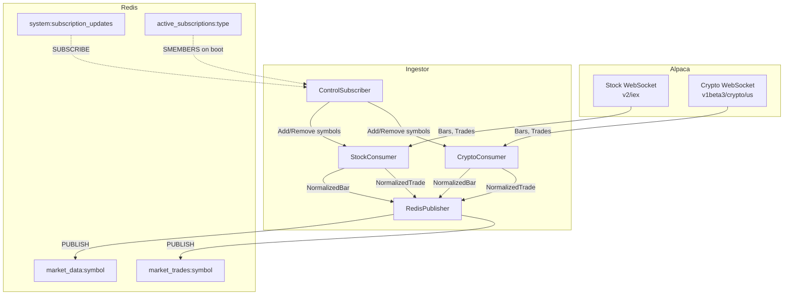
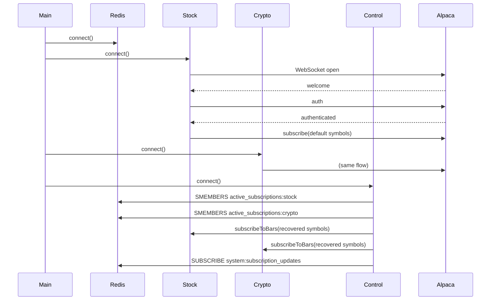

# Ingestor Service Design

## Overview

The **ingestor-node** service is responsible for streaming real-time market data from Alpaca and publishing it to Redis for downstream consumers (Worker, Gateway).

---

## Architecture



---

## Components

### StockConsumer
WebSocket client for Alpaca stock data (`wss://stream.data.alpaca.markets/v2/iex`)

| Method | Purpose |
|--------|---------|
| `connect()` | Establish WebSocket connection |
| `authenticate()` | Send API key/secret after welcome message |
| `subscribeToBars(symbols)` | Subscribe to 1-min bars for symbols |
| `subscribeToTrades(symbols)` | Subscribe to tick-level trades |
| `processBar(msg)` | Normalize Alpaca bar → `NormalizedBar` |
| `processTrade(msg)` | Normalize Alpaca trade → `NormalizedTrade` |

### CryptoConsumer
WebSocket client for Alpaca crypto data (`wss://stream.data.alpaca.markets/v1beta3/crypto/us`)

Same interface as StockConsumer, handles crypto symbols like `BTC/USD`, `ETH/USD`.

### RedisPublisher
Simple Redis client for publishing messages.

| Method | Purpose |
|--------|---------|
| `connect()` | Connect to Redis |
| `publish(channel, message)` | Publish JSON to channel |
| `disconnect()` | Clean disconnect |

### ControlSubscriber
Listens for session lifecycle events from Gateway.

| Method | Purpose |
|--------|---------|
| `connect()` | Subscribe to `system:subscription_updates` |
| `reconcile()` | On boot, read `active_subscriptions:*` sets to restore state |
| `handleMessage(msg)` | Parse `subscribe`/`unsubscribe` events, modify WebSocket subscriptions |

---

## Data Types

### NormalizedBar
```typescript
interface NormalizedBar {
    symbol: string;       // "AAPL", "BTC/USD"
    timeframe: "1m";
    open: number;
    high: number;
    low: number;
    close: number;
    volume: number;
    timestamp: string;    // UTC ISO String
}
```

### NormalizedTrade
```typescript
interface NormalizedTrade {
    symbol: string;
    price: number;
    size: number;
    timestamp: string;
    tickType: "trade";
}
```

---

## Redis Interactions

| Direction | Channel/Key | Data |
|-----------|-------------|------|
| **PUBLISH** | `market_data:{symbol}` | NormalizedBar JSON |
| **PUBLISH** | `market_trades:{symbol}` | NormalizedTrade JSON |
| **SUBSCRIBE** | `system:subscription_updates` | ControlEvent JSON |
| **READ** | `active_subscriptions:stock` | Set of stock symbols |
| **READ** | `active_subscriptions:crypto` | Set of crypto symbols |

---

## Startup Flow



---

## Configuration

| Variable | Default | Description |
|----------|---------|-------------|
| `ALPACA_API_KEY` | — | Alpaca API key (required) |
| `ALPACA_SECRET_KEY` | — | Alpaca API secret (required) |
| `REDIS_URL` | `redis://localhost:6379` | Redis connection string |
| `SYMBOLS` | `['AAPL', 'SPY', 'QQQ']` | Default stocks to subscribe |
| `CRYPTO_SYMBOLS` | `['BTC/USD', 'ETH/USD']` | Default crypto to subscribe |

---

## File Structure

```
services/ingestor-node/
├── src/
│   ├── index.ts              # Entry point, wires components
│   ├── config.ts             # Environment configuration
│   ├── types.ts              # NormalizedBar, NormalizedTrade
│   ├── services/
│   │   ├── BaseConsumer.ts   # Abstract base with subscription tracking
│   │   ├── StockConsumer.ts  # Stock WebSocket client
│   │   ├── CryptoConsumer.ts # Crypto WebSocket client
│   │   ├── RedisPublisher.ts # Redis publish wrapper
│   │   └── ControlSubscriber.ts # Control plane listener
│   └── utils/
│       └── logger.ts         # Logging utility
├── package.json
└── tsconfig.json
```
