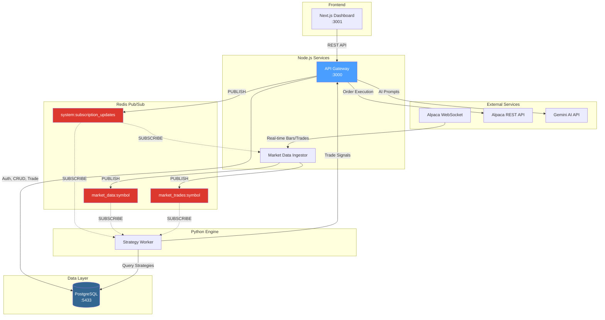
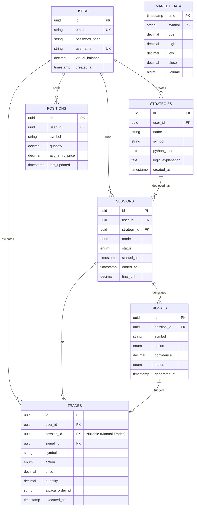

# StratForge Schema Design

## Overview

StratForge is an AI-powered paper trading platform that enables users to create, test, and execute algorithmic trading strategies. This document provides a comprehensive view of the system architecture, data models, and component interactions.

---

## Design Philosophy

### Event-Driven "Reactive-Lite" Architecture
StratForge decouples high-throughput market data from user management using Redis Pub/Sub. This "Reactive-Lite" approach allows the system to scale horizontally—handling increasing feed volumes and complex strategy evaluations without bottlenecking the user-facing API.

### Polyglot Service Specialization
w

### Virtualization Proxy Pattern
To support multi-tenancy on a single brokerage account, we implement a **Virtualization Proxy Layer**. This abstraction maintains independent "virtual portfolios" in PostgreSQL, validating trades against virtual balances before executing them on the shared real-world Alpaca account.

### Canonical Data Normalization
The **Ingestor** service acts as a translation layer, converting provider-specific payloads into a standardized internal schema (`NormalizedBar`) before they enter the Redis pipeline. This immunizes core strategy logic from upstream API changes.

---

## System Architecture



---

## Entity Relationship Diagram



---

## Core Tables

| Table | Purpose |
|-------|---------|
| **users** | User accounts with virtual balance |
| **strategies** | AI-generated trading strategy definitions |
| **sessions** | Strategy execution instances |
| **signals** | AI-generated trade intents |
| **trades** | Executed orders with Alpaca |
| **positions** | Virtual portfolio holdings per user |
| **market_data** | Historical OHLCV price data |

---

## Data Flows

### 1. User Creates Strategy (AI-Powered)

```
User → Gateway → Gemini AI → Strategy saved to PostgreSQL
```

### 2. Real-Time Market Data

```
Alpaca WebSocket → Ingestor → Redis (market_data:{symbol}) → Worker
```

### 3. Session Lifecycle (Control Flow)

```
User starts session → Gateway → Redis (system:subscription_updates) → Ingestor + Worker
```

### 4. Strategy Execution

```
Worker receives bar → Evaluates strategy → Signal → Gateway → Alpaca order
```

### 5. Portfolio Virtualization

```
User views portfolio → Gateway queries virtual positions → Enriches with live prices
```

> **Note**: See [virtualization_design.md](./virtualization_design.md) for detailed virtualization architecture.

---

## Service Inventory

| Service | Tech | Port | Responsibility |
|---------|------|------|----------------|
| **gateway-node** | Express + TS | 3000 | REST API, auth, trade execution |
| **ingestor-node** | Node.js + TS | — | WebSocket → Redis pipeline |
| **worker-python** | Python 3.10 | — | Strategy evaluation engine |
| **frontend** | Next.js 16 | 3001 | User dashboard |
| **Redis** | Redis 7 | 6379 | Pub/Sub messaging |
| **PostgreSQL** | PG 15 | 5433 | Persistent storage |

---

## Redis Channels

| Channel | Publisher | Subscriber | Data |
|---------|-----------|------------|------|
| `market_data:{symbol}` | Ingestor | Worker | 1-min OHLCV bars |
| `market_trades:{symbol}` | Ingestor | Worker | Tick-level trades |
| `system:subscription_updates` | Gateway | Ingestor, Worker | Session lifecycle |

---

## Related Documents

### Service Deep-Dives
| Document | Description |
|----------|-------------|
| [ingestor_design.md](./ingestor_design.md) | Market data ingestion pipeline |
| [gateway_design.md](./gateway_design.md) | REST API and trade execution |
| [worker_design.md](./worker_design.md) | Strategy execution engine |

### Other
| Document | Description |
|----------|-------------|
| [virtualization_design.md](./virtualization_design.md) | Multi-user virtual portfolio system |
| [API_Design.md](../docs/API_Design.md) | REST API endpoints and schemas |
| [ONBOARDING.md](../docs/ONBOARDING.md) | Developer quick start guide |
