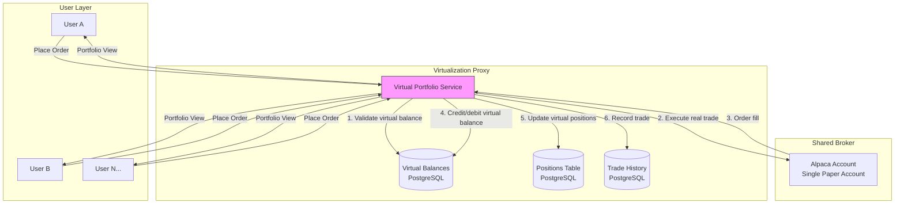
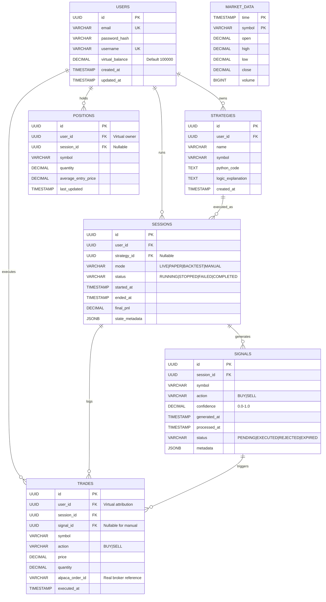
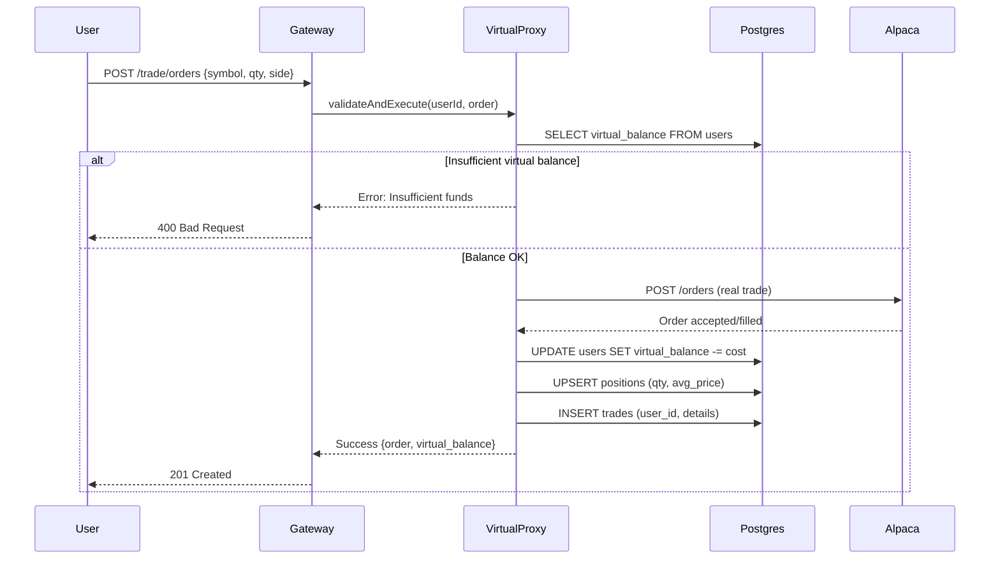
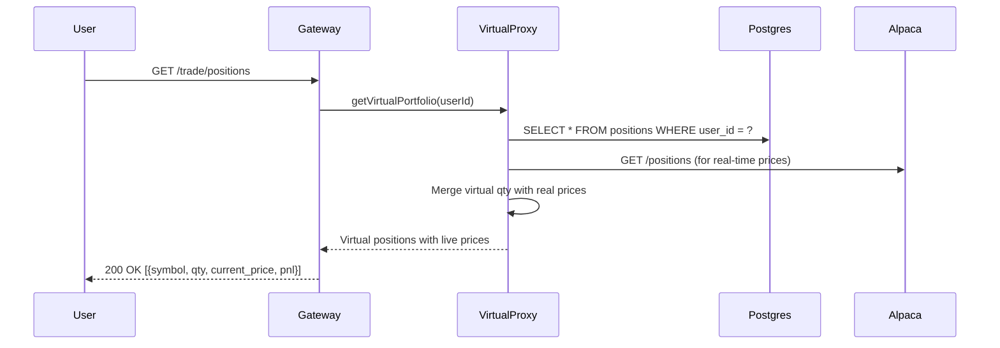

# StratForge Schema Design

## Overview

StratForge operates on a **single Alpaca paper trading account** shared across all users. To provide each user with an independent trading experience, we implement a **Virtualization Proxy Layer** that:

1. Maintains per-user virtual balances and positions in PostgreSQL
2. Routes trades through the shared Alpaca account
3. Attributes order fills back to the originating user
4. Projects personalized portfolio views from virtual state

---

## Virtualization Architecture

---

## Key Concepts

### Virtual Balance
Each user has a `virtual_balance` (default $100,000) that represents their simulated buying power. This is **completely independent** of the actual Alpaca account balance.

### Virtual Positions
Each user's positions are tracked in the `positions` table with `user_id`. When User A buys AAPL, it doesn't affect User B's AAPL position.

### Real Trades → Virtual Attribution
All trades go through the real Alpaca API (for realistic fills/slippage), but:
- The trade is recorded with `user_id` in our database
- Virtual balance is updated based on the fill
- Virtual position is updated (quantity, avg price)

---

## Entity Relationship Diagram

---

## Virtualization Proxy Flow

### Order Placement

### Portfolio View

---

## Table Schemas

### users
| Column | Type | Description |
|--------|------|-------------|
| id | UUID | Primary key |
| email | VARCHAR(255) | Unique, login identifier |
| password_hash | VARCHAR(255) | Bcrypt hash |
| username | VARCHAR(50) | Display name |
| **virtual_balance** | DECIMAL | Simulated buying power (default $100,000) |
| created_at | TIMESTAMP | Account creation |
| updated_at | TIMESTAMP | Last modification |

### positions
| Column | Type | Description |
|--------|------|-------------|
| id | UUID | Primary key |
| **user_id** | UUID FK | Virtual owner of position |
| session_id | UUID FK | Optional session association |
| symbol | VARCHAR(10) | Ticker symbol |
| quantity | DECIMAL | Number of shares/units |
| average_entry_price | DECIMAL | Cost basis per share |
| last_updated | TIMESTAMP | Last trade update |

**Unique constraint**: `(user_id, symbol)` — one position per symbol per user

### trades
| Column | Type | Description |
|--------|------|-------------|
| id | UUID | Primary key |
| **user_id** | UUID FK | Virtual owner of trade |
| session_id | UUID FK | Strategy session (if automated) |
| signal_id | UUID FK | Triggering signal (if automated) |
| symbol | VARCHAR(10) | Ticker symbol |
| action | VARCHAR(4) | BUY or SELL |
| price | DECIMAL | Execution price |
| quantity | DECIMAL | Number of shares |
| **alpaca_order_id** | VARCHAR | Reference to real Alpaca order |
| executed_at | TIMESTAMP | Execution time |

---

## Implementation Status

| Component | Status | Notes |
|-----------|--------|-------|
| `virtual_balance` column | ✅ Done | Migration 002 |
| `user_id` on trades | ✅ Done | Migration 002 |
| `user_id` on positions | ✅ Done | Migration 003 |
| Balance validation on order | ⚠️ Partial | Needs enforcement in TradeController |
| Virtual position update on fill | ⚠️ Partial | Logic exists but needs hardening |
| `alpaca_order_id` tracking | ❌ Missing | Add to trades table |

---

## Next Steps

1. **Add `alpaca_order_id` to trades** — Track real broker order references
2. **Enforce balance validation** — Reject orders when `virtual_balance` < order cost
3. **Position update on fill** — Atomic update of quantity and average price
4. **Portfolio endpoint** — Return virtual positions enriched with live prices
5. **P&L calculation** — `(current_price - avg_entry_price) * quantity`
