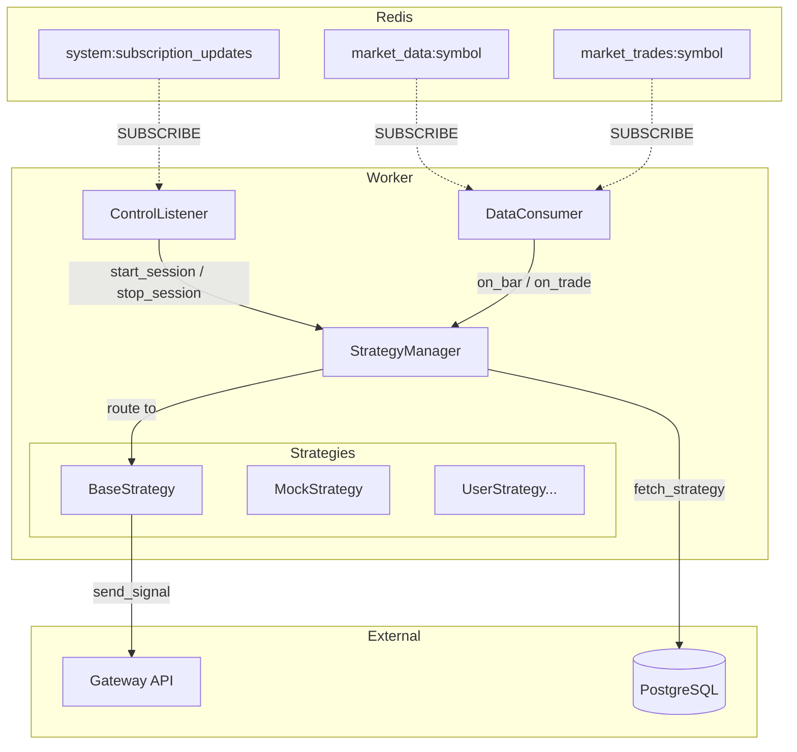
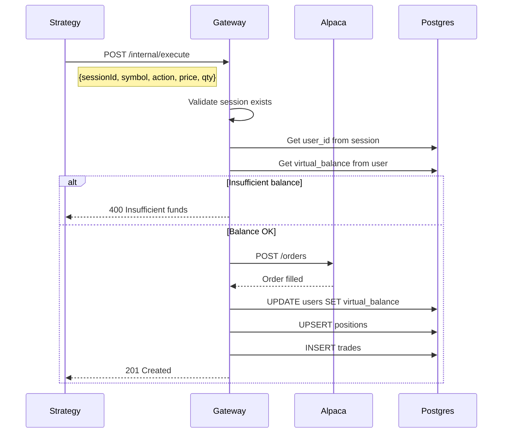

# Worker Service Design

## Overview

The **worker-python** service is the strategy execution engine. It subscribes to market data from Redis, evaluates trading strategies, and sends trade signals to the Gateway for execution.

---

## Architecture



---

## Components

### Main Entry Point
Spawns two daemon threads:
1. **ControlListener** - Listens for session lifecycle events
2. **DataConsumer** - Listens for market data

```python
control_thread = threading.Thread(target=control_worker.start, daemon=True)
data_thread = threading.Thread(target=data_worker.start, daemon=True)
```

### ControlListener
Subscribes to `system:subscription_updates` and manages strategy instances.

| Method | Purpose |
|--------|---------|
| `start()` | Subscribe to channel, enter listen loop |
| `handle subscribe` | Call `manager.start_session(symbol, strategy_id)` |
| `handle unsubscribe` | Call `manager.stop_session(symbol, strategy_id)` |

### DataConsumer
Subscribes to market data for active symbols.

| Method | Purpose |
|--------|---------|
| `start()` | Pattern subscribe to `market_data:*`, enter listen loop |
| `on_message()` | Parse Bar/Trade, call `manager.on_bar()` or `manager.on_trade()` |

### StrategyManager
Central registry for active strategy instances.

| Method | Purpose |
|--------|---------|
| `start_session(symbol, strategy_id)` | Fetch strategy from DB, instantiate, call `on_start()` |
| `stop_session(symbol, strategy_id)` | Call `on_stop()`, remove from registry |
| `on_bar(bar)` | Route bar to all strategies watching that symbol |
| `on_trade(trade)` | Route trade to all strategies watching that symbol |

**Active Strategies Structure:**
```python
# symbol -> { strategy_id -> BaseStrategy instance }
active_strategies: Dict[str, Dict[str, BaseStrategy]] = {}
```

---

## Strategy Framework

### BaseStrategy (Abstract)
All strategies extend this base class.

```python
class BaseStrategy(ABC):
    def __init__(self, strategy_id: str, symbol: str, session_id: str = None):
        self.strategy_id = strategy_id
        self.symbol = symbol
        self.session_id = session_id

    @abstractmethod
    def on_bar(self, bar: Bar):
        pass

    @abstractmethod
    def on_trade(self, trade: Trade):
        pass
    
    def on_start(self):
        # Called when strategy starts
        pass

    def on_stop(self):
        # Called when strategy stops
        pass

    def send_signal(self, action: str, price: float, quantity: float, confidence: float):
        # POST to /internal/execute
        pass
```

### MockStrategy
Simple test strategy that logs bars.

```python
class MockStrategy(BaseStrategy):
    def on_bar(self, bar: Bar):
        print(f"[MOCK] {bar.symbol} closed at {bar.close}")
    
    def on_trade(self, trade: Trade):
        print(f"[MOCK] {trade.symbol} trade at {trade.price}")
```

### Future: Dynamic Strategy
Load and execute user-defined Python code from the database.

```python
class DynamicStrategy(BaseStrategy):
    def __init__(self, strategy_id, symbol, session_id, python_code):
        super().__init__(strategy_id, symbol, session_id)
        self.user_code = compile(python_code, "<strategy>", "exec")
    
    def on_bar(self, bar):
        exec(self.user_code, {"bar": bar, "send_signal": self.send_signal})
```

---

## Data Models

### Bar
```python
class Bar(BaseModel):
    symbol: str
    timeframe: str
    open: float
    high: float
    low: float
    close: float
    volume: int
    timestamp: str
```

### Trade
```python
class Trade(BaseModel):
    symbol: str
    price: float
    size: float
    timestamp: str
    tickType: str
```

### ControlEvent
```python
class ControlEvent(BaseModel):
    action: str       # "subscribe" | "unsubscribe"
    symbol: str
    type: str         # "stock" | "crypto"
    strategyId: Optional[str]
    sessionId: Optional[str]
```

---

## Redis Interactions

| Direction | Channel/Key | Purpose |
|-----------|-------------|---------|
| **SUBSCRIBE** | `system:subscription_updates` | Receive session lifecycle |
| **PSUBSCRIBE** | `market_data:*` | Receive bar data for all symbols |
| **PSUBSCRIBE** | `market_trades:*` | Receive trade data |

---

## Signal Execution Flow



---

## File Structure

```
services/worker-python/
├── main.py                   # Entry point, thread spawning
├── config.py                 # Environment configuration
├── requirements.txt          # Dependencies
├── models/
│   └── market_data.py        # Bar, Trade, ControlEvent
├── services/
│   ├── redis_client.py       # Redis connection wrapper
│   ├── db_client.py          # PostgreSQL client
│   ├── control_listener.py   # Control plane subscriber
│   ├── data_consumer.py      # Market data subscriber
│   └── strategy_manager.py   # Strategy registry
└── strategies/
    ├── base_strategy.py      # Abstract base class
    └── mock_strategy.py      # Test implementation
```

---

## Configuration

| Variable | Default | Description |
|----------|---------|-------------|
| `REDIS_URL` | `redis://localhost:6379` | Redis connection |
| `DATABASE_URL` | — | PostgreSQL connection |
| `GATEWAY_URL` | `http://localhost:3000` | Gateway for signal execution |

---

## Threading Model

```
main.py
  │
  ├── control_thread (daemon)
  │     └── ControlListener.start()
  │           └── pubsub.listen() [blocking]
  │
  └── data_thread (daemon)
        └── DataConsumer.start()
              └── pubsub.psubscribe() [blocking]
```

Both threads share the same `StrategyManager` instance with proper routing.
