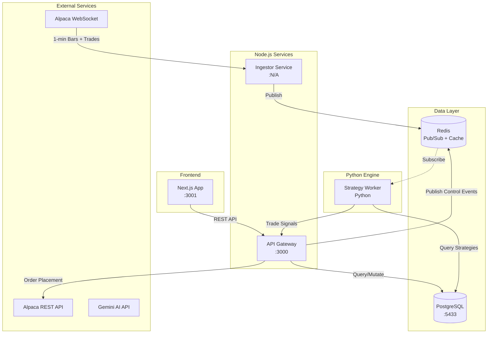
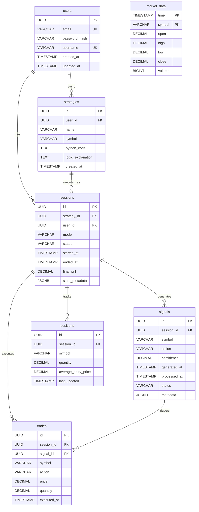
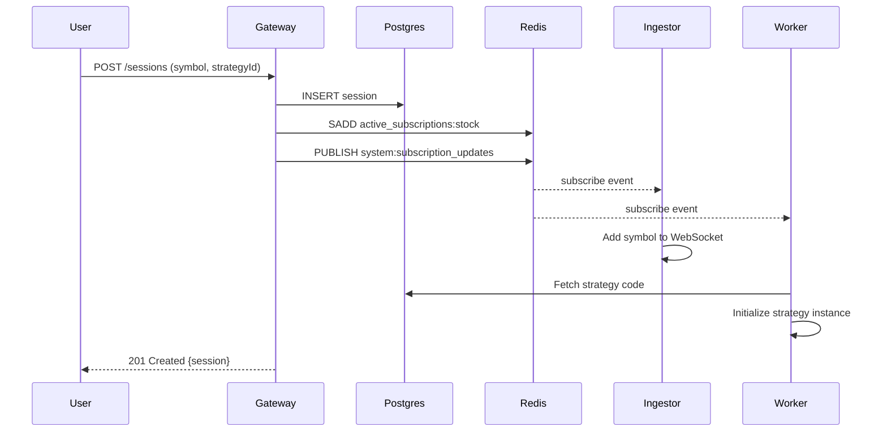
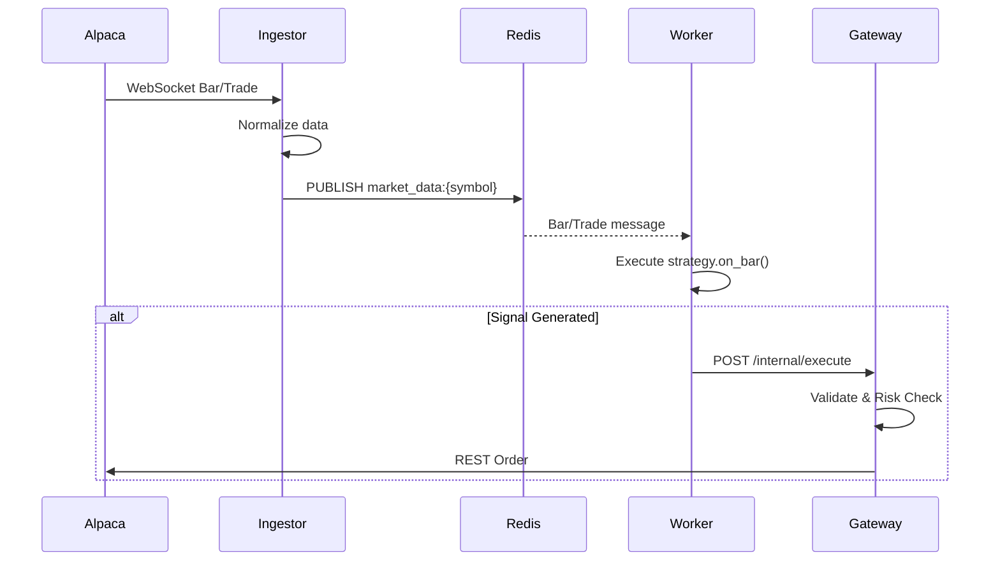

# StratForge API Design Document

## Overview

StratForge is an event-driven paper trading platform with a "Reactive-Lite" architecture. This document details the current API landscape across all services, data schemas, and inter-service communication patterns.

---

## System Architecture



---

## Service Inventory

| Service | Technology | Port | Purpose |
|---------|------------|------|---------|
| **gateway-node** | Node.js + Express + TypeScript | 3000 | REST API, session management, trade execution |
| **ingestor-node** | Node.js + TypeScript | N/A | Market data ingestion from Alpaca WebSocket |
| **worker-python** | Python 3.10+ | N/A | Strategy execution engine |
| **frontend** | Next.js + React | 3001 | User dashboard |
| **Redis** | Redis 7 | 6379 | Pub/Sub message broker |
| **PostgreSQL** | PostgreSQL 15 | 5433 | Persistent data store |

---

## REST API Endpoints (Gateway Service)

### Sessions API

Base URL: `/sessions`

#### Create Session
```http
POST /sessions
Content-Type: application/json

{
  "symbol": "AAPL",
  "type": "stock" | "crypto",
  "strategyId": "uuid"
}
```

**Response (201 Created):**
```json
{
  "message": "Session started",
  "data": {
    "session": {
      "id": "uuid",
      "symbol": "AAPL",
      "type": "stock",
      "strategyId": "uuid",
      "status": "RUNNING",
      "createdAt": "2026-01-28T10:00:00Z"
    },
    "event": {
      "action": "subscribe",
      "symbol": "AAPL",
      "type": "stock"
    }
  }
}
```

**Side Effects:**
1. Creates session record in PostgreSQL
2. Adds symbol to Redis set `active_subscriptions:{type}`
3. Publishes subscribe event to `system:subscription_updates`

---

#### Stop Session
```http
POST /sessions/:id/stop
```

**Response (200 OK):**
```json
{
  "message": "Session stopped",
  "sessionId": "uuid"
}
```

**Side Effects:**
1. Updates session status to `STOPPED` in PostgreSQL
2. If no other active sessions for symbol, removes from Redis set
3. Publishes unsubscribe event if symbol no longer needed

---

### Trade API

Base URL: `/trade`

#### Get Account Info
```http
GET /trade/account
```

**Response:**
```json
{
  "id": "alpaca-account-id",
  "account_number": "PA12345678",
  "status": "ACTIVE",
  "currency": "USD",
  "buying_power": "100000.00",
  "cash": "50000.00",
  "portfolio_value": "75000.00",
  "equity": "75000.00",
  "...": "additional Alpaca account fields"
}
```

---

#### Get Positions
```http
GET /trade/positions
```

**Response:**
```json
[
  {
    "asset_id": "uuid",
    "symbol": "AAPL",
    "qty": "10",
    "avg_entry_price": "150.00",
    "market_value": "1750.00",
    "unrealized_pl": "250.00",
    "current_price": "175.00"
  }
]
```

---

#### Get Orders
```http
GET /trade/orders?status=all|open|closed
```

**Response:**
```json
[
  {
    "id": "order-uuid",
    "symbol": "AAPL",
    "qty": "10",
    "side": "buy",
    "type": "market",
    "status": "filled",
    "filled_avg_price": "150.00",
    "submitted_at": "2026-01-28T10:00:00Z",
    "filled_at": "2026-01-28T10:00:01Z"
  }
]
```

---

#### Place Order
```http
POST /trade/orders
Content-Type: application/json

{
  "symbol": "AAPL",
  "qty": 10,
  "side": "buy" | "sell",
  "type": "market" | "limit",
  "limit_price": 150.00
}
```

**Response (201 Created):**
```json
{
  "id": "order-uuid",
  "client_order_id": "uuid",
  "symbol": "AAPL",
  "qty": "10",
  "side": "buy",
  "type": "market",
  "status": "accepted",
  "submitted_at": "2026-01-28T10:00:00Z"
}
```

---

## Redis Pub/Sub Channels

### Market Data Channels (Ingestor → Worker)

| Channel Pattern | Publisher | Subscriber | Payload |
|-----------------|-----------|------------|---------|
| `market_data:{symbol}` | Ingestor | Worker | NormalizedBar |
| `market_trades:{symbol}` | Ingestor | Worker | NormalizedTrade |

#### NormalizedBar Schema
```typescript
interface NormalizedBar {
  symbol: string;       // e.g., "AAPL", "BTC/USD"
  timeframe: "1m";
  open: number;
  high: number;
  low: number;
  close: number;
  volume: number;
  timestamp: string;    // UTC ISO String
}
```

#### NormalizedTrade Schema
```typescript
interface NormalizedTrade {
  symbol: string;
  price: number;
  size: number;
  timestamp: string;    // UTC ISO String
  tickType: "trade";
}
```

---

### Control Channels (Gateway ↔ Ingestor/Worker)

| Channel | Publisher | Subscribers | Purpose |
|---------|-----------|-------------|---------|
| `system:subscription_updates` | Gateway | Ingestor, Worker | Session lifecycle events |

#### ControlEvent Schema
```typescript
interface ControlEvent {
  action: "subscribe" | "unsubscribe";
  symbol: string;
  type: "stock" | "crypto";
  strategyId?: string;
}
```

---

### Redis Sets (State Persistence)

| Key Pattern | Purpose |
|-------------|---------|
| `active_subscriptions:stock` | Set of active stock symbols |
| `active_subscriptions:crypto` | Set of active crypto symbols |

Used for **boot reconciliation** when ingestor restarts.

---

## Database Schema (PostgreSQL)

### Entity Relationship Diagram



---

## Internal APIs (Not Yet Implemented)

### Worker → Gateway (Planned)

#### Execute Trade Signal
```http
POST /internal/execute
Content-Type: application/json

{
  "sessionId": "uuid",
  "strategyId": "uuid",
  "symbol": "AAPL",
  "action": "BUY" | "SELL",
  "quantity": 10,
  "confidence": 0.85,
  "metadata": {
    "indicator": "RSI",
    "value": 30
  }
}
```

---

## API Gaps & Recommendations

### Missing REST Endpoints

| Priority | Endpoint | Method | Description |
|----------|----------|--------|-------------|
| **High** | `/api/users` | POST | User registration |
| **High** | `/api/auth/login` | POST | Authentication |
| **High** | `/api/strategies` | GET/POST | Strategy CRUD |
| **High** | `/api/strategies/:id` | GET/PUT/DELETE | Single strategy management |
| **High** | `/api/strategies/:id/toggle` | PATCH | Activate/pause strategy |
| **Medium** | `/api/ai/research` | POST | Market research (Agent A) |
| **Medium** | `/api/ai/generate` | POST | Strategy generation (Agent B) |
| **Medium** | `/api/portfolio` | GET | Aggregated portfolio view |
| **Medium** | `/api/sessions` | GET | List sessions with filtering |
| **Low** | `/api/signals` | GET | Query signal history |
| **Low** | `/api/trades` | GET | Query trade history |

---

### Missing Inter-Service Endpoints

| Priority | From | To | Endpoint | Description |
|----------|------|----|---------| ------------|
| **High** | Worker | Gateway | `POST /internal/execute` | Trade signal execution |
| **Medium** | Worker | Gateway | `POST /internal/signal` | Record signal without executing |

---

### Missing WebSocket Endpoints

| Priority | Endpoint | Description |
|----------|----------|-------------|
| **High** | `ws://gateway/live` | Real-time portfolio updates to frontend |
| **Medium** | `ws://gateway/market` | Real-time price streaming to frontend |

---

## Service Communication Patterns

### Session Lifecycle



### Market Data Flow



---

## Configuration Summary

### Environment Variables

| Service | Variable | Default | Description |
|---------|----------|---------|-------------|
| All | `REDIS_URL` | `redis://localhost:6379` | Redis connection |
| Gateway | `DATABASE_URL` | - | PostgreSQL connection |
| Gateway | `PORT` | 3000 | Server port |
| Gateway | `ALPACA_API_KEY` | - | Alpaca API key |
| Gateway | `ALPACA_SECRET_KEY` | - | Alpaca API secret |
| Ingestor | `PORT` | 3001 | Server port |
| Ingestor | `SYMBOLS` | `AAPL,MSFT,NVDA` | Default stocks |
| Ingestor | `CRYPTO_SYMBOLS` | `BTC/USD,ETH/USD` | Default crypto |

---

## Summary

### Current State

| Component | Status |
|-----------|--------|
| Infrastructure (Docker, Redis, Postgres) | ✅ Complete |
| Market Data Ingestion | ✅ Complete |
| Session Management API | ✅ Complete |
| Trade Execution API (Alpaca) | ✅ Complete |
| Redis Pub/Sub Architecture | ✅ Complete |
| Worker Strategy Framework | ⚠️ Partial (mock only) |
| User Authentication | ❌ Not Started |
| Strategy CRUD API | ❌ Not Started |
| AI Agent Integration | ❌ Not Started |
| Frontend Dashboard | ⚠️ Minimal |
| Worker → Gateway Signals | ❌ Not Started |

### Next Steps (Recommended Priority)

1. **Authentication System** - JWT-based auth with `/api/auth/*` endpoints
2. **Strategy CRUD** - Full `/api/strategies/*` REST API
3. **Internal Execute Endpoint** - `POST /internal/execute` for worker signals
4. **Real Strategy Execution** - Replace `MockStrategy` with dynamic `exec()` runner
5. **AI Agent Integration** - Gemini API for strategy generation
6. **Frontend Expansion** - Strategy creation UI, real-time charts
